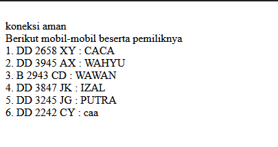
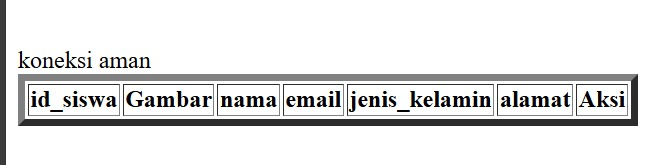
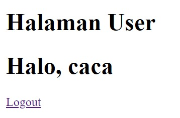
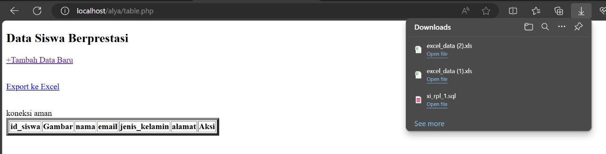

# Koneksi Database
## Penjelasan
1. **Menentukan Kredensial Database**:
    - **Server**: Biasanya `localhost` jika database berada di server yang sama dengan aplikasi PHP.
    - **Username**: Nama pengguna yang memiliki akses ke database, contohnya `root`.
    - **Password**: Kata sandi untuk pengguna database.
    - **Database**: Nama database yang ingin diakses, misalnya `nama_database`.
2. **Menggunakan `mysqli_connect`**:
    - Fungsi ini digunakan untuk membuka koneksi ke database MySQL.
    - Memerlukan empat parameter: server, username, password, dan nama database.
3. **Memeriksa Koneksi**:
    - Setelah memanggil `mysqli_connect`, periksa apakah koneksi berhasil.
    - Jika koneksi berhasil, Anda dapat melanjutkan dengan operasi database.
    - Jika koneksi gagal, tampilkan pesan kesalahan.
4. **Menangani Kesalahan Koneksi**:
    - Gunakan `mysqli_connect_error` untuk mendapatkan pesan error jika koneksi gagal.
    - Informasi ini membantu dalam mendiagnosis masalah koneksi.
5. **Menutup Koneksi**:
    - Setelah selesai menggunakan database, tutup koneksi menggunakan `mysqli_close` untuk membebaskan sumber daya.
## Kode Program
```php
<?php
$koneksi = mysqli_connect('localhost', 'root', '', 'rental_ftsa');
if ($koneksi) {
    echo "<br> koneksi aman <br>";
} else {
    echo "error, tidak bisa koneksi ke database";
} 
$select = mysqli_query($koneksi, "SELECT * FROM daftar_mobil");
//membuat array asosiatif dan memecah data berdasarkan kolomnya
$result = mysqli_fetch_assoc($select);
//menampilkan struktur array dari data tabel yang dijalankan di atas
//var_dump($result); 
echo 'Berikut mobil-mobil beserta pemiliknya<br>';

$a = 1;

foreach ($select as $key => $data) {

    echo $a++ . ". " . $data['no_plat'] . " : " . $data['pemilik'] . '<br>';

} bh
//echo '<p>Halo ' . $result['pemilik'] . '!!</p><br>';
```
## Hasil

## Analisis
1. **Koneksi ke Database**:
    - Menggunakan `mysqli_connect` untuk menghubungkan ke database MySQL dengan parameter server `localhost`, username `root`, password kosong, dan nama database `rental_ftsa`.
    - Memeriksa apakah koneksi berhasil dengan kondisi `if ($koneksi)`. Jika koneksi berhasil, menampilkan pesan "koneksi aman". Jika gagal, menampilkan pesan error.
2. **Menjalankan Query SQL**:
    - Menjalankan query SQL `SELECT * FROM daftar_mobil` menggunakan `mysqli_query` untuk mengambil semua data dari tabel `daftar_mobil`.
    - Menyimpan hasil query dalam variabel `$select`.
3. **Mengambil dan Menampilkan Data**:
    - Menampilkan judul "Berikut mobil-mobil beserta pemiliknya".
    - Menginisialisasi variabel `$a` dengan nilai 1 untuk penomoran urut.
    - Menggunakan loop `foreach` untuk iterasi setiap baris hasil query.
    - Dalam loop, menampilkan nomor urut, nomor plat, dan pemilik mobil dari setiap baris data.
## Kesimpulan

# Tampilkan Data
## penjelasan
Menampilkan data dari database MySQL menggunakan PHP adalah salah satu cara yang umum digunakan untuk membuat aplikasi web.
## Kode Program
```php
<!DOCTYPE html>

<html lang="en">

<head>

    <meta charset="UTF-8">

    <meta name="viewport" content="width=device-width, initial-scale=1.0">

    <title>index tabel</title>

</head>

<body>

    <h2>Data Siswa Berprestasi</h2>

    <a href="tambah.php">+Tambah Data Baru</a><br><br>

    <p>

        <a href="export.php"> export excel </a>

    </p>

    <table border="5">

    <tr>

        <th>id_siswa</th>

        <th>gambar</th>

        <th>nama</th>

        <th>email</th>

        <th>jenis_kelamin</th>

        <th>alamat</th>

        <th>Aksi</th>

    </tr>

  

    <?php

    include "koneksi.php";

    $i = 1;

    $query = mysqli_query($koneksi, "SELECT * FROM siswa");

    while ($data = mysqli_fetch_array($query)) {

    ?>

  

    <tr>

        <td><?php echo $i; ?></td>

        <td>

            " width="100px">

        </td>

        <td><?php echo $data['nama']; ?></td>

        <td><?php echo $data['email']; ?></td>

        <td><?php echo $data['jenis_kelamin']; ?></td>

        <td><?php echo $data['alamat']; ?></td>

  

        <td>

            <a href="ubah.php?id=<?= $data['id_siswa']; ?>">Ubah</a> |

            <a href="hapus.php?id=<?= $data['id_siswa']; ?>">Hapus</a> |

        </td>

    </tr>

    <?php

    $i++;

    }

    ?>

    </table>

</body>

</html>
```

## hasil
![[php19.png]]
## analisis
1. Deklarasi DOCTYPE dan Struktur Dasar HTML
- `<!DOCTYPE html>`: Mendefinisikan tipe dokumen sebagai HTML5.
- `<html lang="en">: Menentukan bahasa dokumen sebagai bahasa Inggris.
- `<head>`: Bagian header yang berisi metadata dokumen.
- `<meta charset="UTF-8">`: Menentukan karakter encoding dokumen sebagai UTF-8.
- `<meta name="viewport" content="width=device-width, initial-scale=1.0">`: Membuat halaman responsif agar tampil baik pada berbagai ukuran layar.
- `<title>index tabel</title>`: Menentukan judul halaman yang akan muncul di tab browser.
- `<body>`: Bagian yang berisi konten utama halaman.

2. Konten Halaman
- `<h2>Data Siswa Berprestasi</h2>`: Menampilkan judul halaman.
- `<a href="tambah.php">+Tambah Data Baru</a>`: Link untuk menambah data baru.
- `<p><a href="export.php"> export excel </a></p>`: Link untuk mengekspor data ke Excel.
- `<table border="5">`: Membuat tabel dengan border tebal.
- `<tr>`: Mendefinisikan baris tabel.
- `<th>`: Mendefinisikan header kolom tabel.

3. Koneksi ke Database dan Query
- `<?php include "koneksi.php"; ?>`: Menghubungkan ke file `koneksi.php` yang berisi konfigurasi koneksi database.
- `$i = 1;`: Menginisialisasi variabel untuk penomoran baris.
- `$query = mysqli_query($koneksi, "SELECT * FROM siswa");`: Menjalankan query untuk mengambil semua data dari tabel `siswa`.
- `while ($data = mysqli_fetch_array($query)) {`: Loop untuk mengambil setiap baris hasil query dan menampilkannya.

4. Menampilkan Data dalam Tabel
- `<tr>`: Baris baru dalam tabel.
- `<td><?php echo $i; ?></td>`: Menampilkan nomor urut.
- `<td>" width="100px"></td>`: Menampilkan gambar siswa dengan lebar 100px.
- `<td><?php echo $data['nama']; ?></td>`: Menampilkan nama siswa.
- `<td><?php echo $data['email']; ?></td>`: Menampilkan email siswa.
- `<td><?php echo $data['jenis_kelamin']; ?></td>`: Menampilkan jenis kelamin siswa.
- `<td><?php echo $data['alamat']; ?></td>`: Menampilkan alamat siswa.
- `<td>`: Menampilkan link untuk mengubah dan menghapus data siswa dengan ID siswa sebagai parameter.
- `<?php $i++; ?>`: Menambah nilai $i untuk nomor urut selanjutnya.
- `<?php } ?>`: Menutup loop while.
- `</table>`: Menutup tabel.
- `</body>`: Menutup body.
- `</html>`: Menutup dokumen HTML.
## kesimpulan
Kode di atas adalah contoh bagaimana menampilkan data dari database MySQL ke dalam tabel HTML menggunakan PHP. Kode ini juga menunjukkan penggunaan link untuk menambahkan, mengubah, dan menghapus data, serta mengekspor data ke file Excel. Pastikan bahwa file `koneksi.php` berisi pengaturan koneksi database yang benar dan bahwa tabel `siswa` dalam database memiliki struktur yang sesuai dengan yang diharapkan.
# Tambahkan Data
## penjelasan
Menambahkan data ke database MySQL menggunakan PHP adalah cara yang umum digunakan untuk membuat aplikasi web yang dapat menerima input pengguna.
## kode program
```php
<!DOCTYPE html>
<html lang="en">
<head>
    <title>Document</title>
</head>
<body>
    <h2>Tambah Data</h2>
    <?php
    include "koneksi.php";
function upload(): string
{
    $nameImage = $_FILES['gambar']['name'];
    $directoryFile = $_FILES['gambar']['tmp_name'];
    $errorImage = intval($_FILES['gambar']['error']);
    $sizeFile = $_FILES['imageNew']['size'];
    // cek apakah gambar ada
    if ($errorImage === 4) {
        echo "<script>alert('Anda Belum Upload Gambar')</script>";
        return false;
    }
    // mengambil ekstensi file
    $validType = ['svg', 'jpg', 'png', 'jpeg', 'webp'];
    $extensionFile = explode(".", $nameImage);
    $extensionValid = strtolower(end($extensionFile));
    // cek apakah yang diupload gambar atau bukan
    if (!in_array($extensionValid, $validType)) {
        echo "<script>alert('yang anda Upload bukan gambar')</script>";
        return false;
    }
    // cek size file
    if ($sizeFile > 3_000_000) {
        echo "<script>alert('Ukuran File Terlalu Besar!!(Maks 3MB)')</script>";
        return false;
    }
    // upload file
    $nameImage = uniqid() . "." . $extensionValid;
    move_uploaded_file($directoryFile, "../assets/img/{$nameImage}");
    // mengembalikan namafile yg sudah divalidasi
    return $nameImage;
}
    if (isset($_POST['simpan'])) {
        $nama = $_POST['nama'];
        $email = $_POST['email'];
        $jenis_kelamin = $_POST['jenis_kelamin'];
        $alamat = $_POST['alamat'];
        // * true / false
        $query = mysqli_query($koneksi, "INSERT into siswa(nama,email,jenis_kelamin,alamat)
        values ('$nama','$email','$jenis_kelamin','$alamat')");
        if ($query == true) {
            echo "<script>
            alert('Tambah data Berhasil')
            window.location.href='table.php'
            </script>";
        } else {
            echo '<script>alert("Tambah data gagal")</script>';
        }
    }
    ?>
    <form method="post">
        <table>
            <tr>
                <td>Nama</td>
                <td><input type="text" name="nama"></td>
            </tr>
            <tr>
                <td>Email</td>
                <td><input type="text" name="email"></td>
            </tr>
            <tr>
                <td>Jenis Kelamin</td>
                <td>>
                    <select name="jenis_kelamin">
                        <option>Laki-laki</option>
                        <option>Perempuan</option>
                    </select>
                </td>
            </tr>
            <tr>
                <td>Alamat</td>
                <td><input type="text" name="alamat"></td>
            </tr>
            <tr>
                <td></td>
                <td>
                    <button name="simpan" type="submit">Simpan</button>
                    <button type="reset">Reset</button>
                    <a href="table.php">Kembali</a>
                </td>
            </tr>
        </table>
    </form>
</body>
</html>
```
## hasil
![[php20.png]]
## analisis
- `<!DOCTYPE html>`: Mendefinisikan tipe dokumen sebagai HTML5.
- `<html lang="en">`: Menentukan bahasa dokumen sebagai bahasa Inggris.
- `<head>`: Bagian header yang berisi metadata dokumen.
- `<title>Document</title>`: Menentukan judul halaman yang akan muncul di tab browser.
- `<body>`: Bagian yang berisi konten utama halaman.
- `<?php include "koneksi.php"; ?>`: Menyertakan file `koneksi.php` yang berisi konfigurasi koneksi ke database.
- `function upload(): string`: Fungsi untuk mengupload dan memvalidasi gambar.
    - `$_FILES['gambar']['name']`: Mendapatkan nama file gambar yang diupload.
    - `$_FILES['gambar']['tmp_name']`: Mendapatkan nama sementara file di server.
    - `$_FILES['gambar']['error']`: Memeriksa apakah ada error saat upload.
    - `$_FILES['imageNew']['size']`: Mendapatkan ukuran file.
    - `$validType`: Ekstensi file yang valid.
    - `move_uploaded_file`: Memindahkan file yang diupload ke direktori tujuan.
- `if (isset($_POST['simpan']))`: Memeriksa apakah tombol "simpan" telah ditekan.
    - `$_POST['nama'], $_POST['email'], $_POST['jenis_kelamin'], $_POST['alamat']`: Mendapatkan data dari form.
    - `mysqli_query($koneksi, "INSERT into siswa...")`: Menjalankan query untuk menambah data ke tabel `siswa`.
    - `if ($query == true)`: Memeriksa apakah query berhasil dan memberikan umpan balik.
- `<form method="post" enctype="multipart/form-data">`: Formulir untuk mengirim data menggunakan metode POST dan mendukung upload file.
- `<table>`: Membuat tabel untuk mengatur layout formulir.
- `<input type="text" name="nama">`: Input untuk nama.
- `<input type="text" name="email">`: Input untuk email.
- `<select name="jenis_kelamin">`: Dropdown untuk memilih jenis kelamin.
- `<input type="file" name="gambar">`: Input untuk mengupload file gambar.
- `<button name="simpan" type="submit">Simpan</button>`: Tombol untuk menyimpan data.
- `<button type="reset">Reset</button>`: Tombol untuk mereset form.
- `<a href="table.php">Kembali</a>`: Link untuk kembali ke halaman tabel.
## kesimpulan
Kode ini menyediakan formulir untuk menambah data siswa ke database, termasuk upload gambar dengan validasi yang tepat. Penggunaan PHP dan MySQL memungkinkan penyimpanan dan pengambilan data yang efisien, sementara HTML menyediakan antarmuka pengguna yang mudah digunakan. Dengan sedikit perbaikan, kode ini bisa menjadi bagian yang andal dari aplikasi manajemen data siswa.

# Ubah Data
## penjelasan
Mengubah data di aplikasi berbasis PHP dan MySQL melibatkan beberapa langkah penting. Berikut ini adalah penjelasan rinci tentang bagaimana proses ini biasanya dilakukan, disertai dengan contoh kode untuk ilustrasi.
### Langkah-langkah Mengubah Data
1. **Menampilkan Formulir dengan Data Awal**
    - Pertama, kita perlu mengambil data yang ingin diubah dari database dan menampilkannya di dalam formulir.
2. **Mengirim Data yang Diperbarui**
    - Setelah pengguna melakukan perubahan di formulir, data yang diperbarui dikirim ke server melalui metode POST.
3. **Memproses dan Menyimpan Perubahan**
    - Server menerima data yang diperbarui dan menjalankan query UPDATE untuk menyimpan perubahan ke dalam database.
## kode program
```php
<!DOCTYPE html>
<html lang="en">
<head>
    <title>Document</title>
</head>
<body>
    <h2>Ubah Data</h2>
    <?php
    include "koneksi.php";
    $id = $_GET['id_siswa'];
    if (isset($_POST['simpan'])) {
        $nama = $_POST['nama'];
        $email = $_POST['email'];
        $jenis_kelamin = $_POST['jenis_kelamin'];
        $alamat = $_POST['alamat'];
        $query = mysqli_query($koneksi, "UPDATE siswa SET
                                        nama='$nama',
                                        email='$email',
                                        jenis_kelamin='$jenis_kelamin',
                                        alamat='$alamat'
                                        WHERE id_siswa=$id");
        if ($query) {
            echo "<script>
            alert('ubah data Berhasil')
            window.location.href='table.php'
            </script>";
        } else {
            echo '<script>alert("ubah data gagal")</script>';
        }
    }
    $query = mysqli_query($koneksi, "SELECT * FROM siswa where id_siswa=$id");
    $data = mysqli_fetch_array($query);
    if ($data == "") {
        die('Data tidak ada');
    }
    ?>
    <form method="post">
        <table>
            <tr>
                <td>Nama</td>
                <td><input type="text" value="<?= $data['nama'] ?>" name="nama"></td>
            </tr>
            <tr>
                <td>Email</td>
                <td><input type="text" value="<?= $data['email'] ?>" name="email"></td>
            </tr>
            <tr>
                <td>Jenis Kelamin</td>
                <td>>
                    <select name="jenis_kelamin">
                        <option <?php if ($data['jenis_kelamin'] == "laki-laki")
                            echo 'selected'; ?>>Laki-laki</option>
                        <option <?php if ($data['jenis_kelamin'] == "perempuan")
                            echo 'selected'; ?>>Perempuan</option>
                    </select>
                </td>
            </tr>
            <tr>
                <td>Alamat</td>
                <td><input type="text" value="<?= $data['alamat'] ?>" name="alamat"></td>
            </tr>
            <tr>
                <td></td>
                <td>
                    <button name="simpan" type="submit">Ubah</button>
                    <button type="reset">Reset</button>
                    <a href="table.php">Kembali</a>
                </td>
            </tr>
        </table>
    </form>
</body>
</html>
```
## hasil
![[php21.png]]
## analisis
- `<!DOCTYPE html>`: Mendefinisikan tipe dokumen sebagai HTML5.
- `<html lang="en">`: Menentukan bahasa dokumen sebagai bahasa Inggris.
- `<head>`: Bagian header yang berisi metadata dokumen.
- `<title>Document</title>`: Menentukan judul halaman yang akan muncul di tab browser.
- `<body>`: Bagian yang berisi konten utama halaman.
- `include "koneksi.php";`: Menyertakan file koneksi ke database.
- `$id = $_GET['id_siswa'];`: Mendapatkan `id_siswa` dari URL.
- `if (isset($_POST['simpan']))`: Memeriksa apakah tombol simpan telah ditekan.
    - `$_POST['nama'], $_POST['email'], $_POST['jenis_kelamin'], $_POST['alamat']`: Mendapatkan data dari formulir.
    - `mysqli_query($koneksi, "UPDATE siswa SET ... WHERE id_siswa=$id")`: Menjalankan query untuk memperbarui data siswa berdasarkan `id_siswa`.
    - `if ($query)`: Memeriksa apakah query berhasil dijalankan.
        - Jika berhasil, menampilkan pesan sukses dan mengarahkan pengguna kembali ke halaman tabel.
        - Jika gagal, menampilkan pesan kesalahan.
- `$query = mysqli_query($koneksi, "SELECT * FROM siswa where id_siswa=$id");`: Mengambil data siswa berdasarkan `id_siswa`.
- `$data = mysqli_fetch_array($query);`: Mengambil data dalam bentuk array.
- `if ($data == "") { die('Data tidak ada'); }`: Memeriksa apakah data ada, jika tidak, menghentikan eksekusi script dengan pesan kesalahan.
- `<form method="post">`: Formulir menggunakan metode POST untuk mengirim data.
- `<table>`: Membuat tabel untuk mengatur tata letak formulir.
- `<input type="text" value="<?= $data['nama'] ?>" name="nama">`: Input untuk nama, dengan nilai awal diisi dari data yang diambil dari database.
- `<input type="text" value="<?= $data['email'] ?>" name="email">`: Input untuk email.
- `<select name="jenis_kelamin">`: Dropdown untuk memilih jenis kelamin.
    - `<option <?php if ($data['jenis_kelamin'] == "laki-laki") echo 'selected'; ?>>Laki-laki</option>`: Opsi untuk jenis kelamin laki-laki, ditandai sebagai terpilih jika data yang diambil dari database adalah "laki-laki".
    - `<option <?php if ($data['jenis_kelamin'] == "perempuan") echo 'selected'; ?>>Perempuan</option>`: Opsi untuk jenis kelamin perempuan.
- `<input type="text" value="<?= $data['alamat'] ?>" name="alamat">`: Input untuk alamat.
- `<button name="simpan" type="submit">Ubah</button>`: Tombol untuk menyimpan perubahan.
- `<button type="reset">Reset</button>`: Tombol untuk mereset formulir.
- `<a href="table.php">Kembali</a>`: Link untuk kembali ke halaman tabel.
## kesimpulan
Kode ini secara umum melakukan tugasnya dengan baik untuk mengubah data siswa. Namun, untuk meningkatkan keamanan, sangat disarankan untuk menggunakan prepared statements saat menjalankan query SQL. Selain itu, menambahkan validasi input di sisi klien dan server akan membantu memastikan bahwa data yang dimasukkan valid dan aman.

# Hapus Data
## penjelasan
Menghapus data dari database dalam aplikasi berbasis PHP dan MySQL melibatkan beberapa langkah penting. Berikut ini adalah penjelasan rinci tentang bagaimana proses ini biasanya dilakukan, disertai dengan contoh kode untuk ilustrasi.
Langkah-langkah Menghapus Data
1. **Mendapatkan ID Data yang Akan Dihapus**
    - Identifikasi data yang akan dihapus biasanya dilakukan dengan menggunakan ID yang dikirim melalui URL.
2. **Menghapus Data dari Database**
    - Setelah ID diperoleh, query DELETE dijalankan untuk menghapus data dari database.
3. **Menampilkan Pesan Konfirmasi atau Kesalahan**
    - Berdasarkan hasil dari query DELETE, pesan konfirmasi atau kesalahan ditampilkan kepada pengguna.
## kode program
```php
<?php
include('koneksi.php');
if(isset($_GET['id'])){

    $id = $_GET['id'];

    $query = mysqli_query($koneksi, "DELETE FROM siswa WHERE id_siswa = $id");

   if($query) {
            echo "<script>
            alert('Hapus data Berhasil')
            window.location.href='table.php'
            </script>";
        }else {
            echo '<script>alert("Hapus data gagal")</script>';
        }
}
?>
```
## hasil

## analisis
- `include('koneksi.php')` :Bagian ini menyertakan file `koneksi.php` yang berisi detail koneksi ke database MySQL. Dengan menyertakan file ini, skrip PHP dapat berinteraksi dengan database.
- `if(isset($_GET['id'])) {`: Bagian ini memeriksa apakah parameter `id` ada dalam URL. Parameter ini digunakan untuk menentukan data mana yang akan dihapus dari database.
- `$id = $_GET['id'];`: Nilai ID siswa yang akan dihapus diambil dari parameter URL.
- `$query = mysqli_query($koneksi, "DELETE FROM siswa WHERE id_siswa = $id");` Query SQL `DELETE` dijalankan untuk menghapus data siswa yang memiliki `id_siswa` yang sesuai dengan nilai ID yang diberikan.
`if($query) {     echo "<script>     alert('Hapus data Berhasil');     window.location.href='table.php';     </script>"; } else {     echo '<script>alert("Hapus data gagal")</script>'; }`: Jika query berhasil dijalankan (`$query` bernilai `true`), maka pesan sukses ditampilkan kepada pengguna, dan pengguna diarahkan kembali ke halaman `table.php`. Jika query gagal dijalankan (`$query` bernilai `false`), maka pesan kesalahan ditampilkan kepada pengguna.
## kesimpulan
Kode PHP ini digunakan untuk menghapus data dari tabel `siswa` berdasarkan ID yang diterima dari URL. Meskipun kode asli berfungsi, versi yang lebih aman dan terjamin menggunakan validasi ID dan prepared statements untuk mencegah serangan SQL Injection. Validasi ID memastikan bahwa parameter yang diterima adalah angka, sedangkan prepared statements memastikan bahwa query SQL aman dari injeksi.


# Session/Login
## penjelasan
1. **Formulir Login** (`login.html`):
    - Formulir ini meminta pengguna untuk memasukkan username dan password.
    - Formulir ini menggunakan metode `POST` untuk mengirim data ke `login.php`.
2. **Menangani Login** (`login.php`):
    - File ini memeriksa apakah request yang masuk adalah `POST`.
    - Mengambil data yang dikirim dari formulir login.
    - Menggunakan prepared statements untuk memilih pengguna dari database berdasarkan username.
    - Jika username ditemukan, periksa kata sandi yang di-hash menggunakan `password_verify`.
    - Jika kata sandi benar, informasi pengguna disimpan dalam sesi dan pengguna diarahkan ke `dashboard.php`.
    - Jika username atau kata sandi salah, pesan kesalahan ditampilkan.
3. **Koneksi Database** (`koneksi.php`):
    - File ini mengatur koneksi ke database menggunakan `mysqli`.
4. **Logout** (`logout.php`):
    - File ini menghancurkan sesi yang ada dan mengarahkan pengguna kembali ke halaman login.
5. **Dashboard** (`dashboard.php`):
    - Halaman ini memeriksa apakah sesi `username` ada, yang berarti pengguna sudah login.
    - Jika pengguna belum login, mereka diarahkan kembali ke halaman login.
    - Menampilkan pesan selamat datang dan opsi untuk logout.
## kode program
## hasil



## analisis
- Baris pertama (`session_start()`) memulai atau melanjutkan sesi yang ada.
- Kedua, ada dua pengecekan kondisi:
    - Pertama, memeriksa apakah pengguna sudah login (`$_SESSION['status'] == 'login'`) dan bukan admin (`$_SESSION['username'] != 'admin'`). Jika ya, pengguna diarahkan ke halaman `user.php`.
    - Kedua, jika pengguna belum login (`$_SESSION['status'] != 'login'`), maka pengguna diarahkan ke halaman login (`login.php`).
- Halaman ini menyambut admin dengan pesan "Halaman Admin" dan menyapa admin dengan nama yang disimpan dalam sesi (`$_SESSION['nama']`).
- Terdapat juga tautan untuk logout, yang mengarahkan ke `logout.php` untuk mengakhiri sesi.
## kesimpulan
Kode ini dirancang untuk memastikan bahwa hanya pengguna yang sudah login dan bukan admin yang dapat mengakses halaman admin. Jika pengguna belum login, mereka akan diarahkan ke halaman login. Jika pengguna sudah login namun bukan admin, mereka akan diarahkan ke halaman `user.php`. Halaman ini mengandung informasi khusus untuk admin, seperti menyambut admin dengan nama mereka dan memberikan opsi untuk logout.


# Upload & Download
## penjelasan
Upload dan download file adalah fitur umum dalam pengembangan web yang memungkinkan pengguna untuk mengunggah file ke server dan mengunduh file dari server
## kode program
```php
 <?php

include "koneksi.php";

  

$query = mysqli_query($koneksi, 'SELECT * FROM siswa');

  

$data = [];

$data[] = ["ID", "Nama", "email","Jenis Kelamin", "Alamat"];

while ($row = mysqli_fetch_assoc($query)) {

    $data[] = [

        $row['id_siswa'],

        $row['nama'],

        $row['email'],

        $row['jenis_kelamin'],

        $row['alamat']

    ];

}

  

$namafile = "excel_data.xls";

header("Content-Type: application/vnd.ms-excel");

header("Content-Disposition: attachment;filename=\"$namafile\"");

header("Cache-Control: max-age=0");

  

$output = fopen("php://output", "w");

  

foreach ($data as $row) {

    fputcsv($output, $row, "\t");

}

  

fclose($output);

exit;
```
## hasil

## analisis
- `include "koneksi.php";`: Kode ini menyertakan file `koneksi.php` yang berisi informasi untuk terhubung ke database.
- `$query = mysqli_query($koneksi, 'SELECT * FROM siswa');`:  Kode ini menjalankan query SQL untuk mengambil semua data dari tabel `siswa`.
- `$data = []; $data[] = ["ID", "Nama", "email","Jenis Kelamin", "Alamat"]; while ($row = mysqli_fetch_assoc($query)) {     $data[] = [         $row['id_siswa'],         $row['nama'],         $row['email'],         $row['jenis_kelamin'],         $row['alamat']     ]; }`: Data dari setiap baris tabel `siswa` dimasukkan ke dalam array `$data`. Baris pertama array berisi header kolom Excel. Setiap baris data tabel `siswa` kemudian dimasukkan ke dalam array dengan format yang sesuai dengan struktur Excel.
- `$namafile = "excel_data.xls"; header("Content-Type: application/vnd.ms-excel"); header("Content-Disposition: attachment;filename=\"$namafile\""); header("Cache-Control: max-age=0");`: Kode ini mengatur jenis konten menjadi Excel (`application/vnd.ms-excel`) dan menentukan nama file Excel yang akan diunduh.
- `$output = fopen("php://output", "w"); foreach ($data as $row) {     fputcsv($output, $row, "\t"); } fclose($output);`:  Kode ini membuka file output dalam mode penulisan. Setiap baris data dalam array `$data` ditulis ke file output dalam format CSV dengan pemisah tab (`"\t"`). setelah selesai, file output ditutup.
`exit;`: Kode ini memastikan tidak ada output PHP tambahan yang ditambahkan setelah selesai menghasilkan file Excel.
## kesimpulan
Kode ini menghasilkan file Excel yang berisi data dari tabel `siswa`, dengan header kolom dan nilai-nilai yang sesuai. File Excel ini kemudian akan diunduh oleh pengguna setelah memicu aksi pada halaman web.
  