# Apa itu web dinamis dan PHP
Web dinamis adalah jenis situs web yang menggunakan konten yang dapat berubah secara dinamis berdasarkan interaksi pengguna, data yang disimpan dalam database, atau logika bisnis tertentu. Berbeda dengan situs web statis yang memiliki konten tetap, situs web dinamis memungkinkan pengguna untuk berinteraksi dengan konten yang berubah sesuai dengan kebutuhan atau preferensi mereka.

PHP adalah bahasa pemrograman server-side yang sering digunakan untuk mengembangkan aplikasi web dinamis. Singkatan PHP adalah "Hypertext Preprocessor". PHP bekerja di sisi server, yang berarti kode PHP dijalankan di server web sebelum hasilnya dikirim ke browser pengguna. PHP dapat digunakan untuk melakukan berbagai tugas di situs web, termasuk mengambil dan menyimpan data dari database, menghasilkan halaman web secara dinamis, menangani formulir, dan banyak lagi. Ini adalah salah satu bahasa pemrograman paling populer yang digunakan untuk pengembangan web, terutama untuk situs web dinamis.

#  Echo & commentar
Echo merujuk pada tindakan mereproduksi atau membagikan kembali konten yang sudah ada kepada pengikut atau audiens Anda. Misalnya, jika seseorang memposting tweet atau kiriman di platform sosial lainnya, dan Anda memutuskan untuk membagikan kembali (retweet, share, dll.) konten tersebut kepada pengikut Anda, itu disebut sebagai "echo". Praktik ini memungkinkan untuk menyebarkan informasi lebih luas atau memberi penghargaan pada konten yang dianggap relevan atau menarik.

Komentar, di sisi lain, adalah respons atau tanggapan yang diberikan oleh pengguna terhadap konten yang diposting oleh pengguna lain. Ini bisa berupa pertanyaan, pendapat, dukungan, kritik, atau reaksi lainnya terhadap apa yang telah dibagikan. Komentar memungkinkan untuk berinteraksi dengan konten dan pengguna lainnya, membuka diskusi, atau memberikan umpan balik.

# Variable, const, operator
**Variable**: Variabel adalah tempat untuk menyimpan data yang dapat berubah nilainya selama eksekusi program. Anda bisa mendeklarasikan variabel dengan menggunakan tanda dollar ($) diikuti dengan nama variabelnya. Contoh:

```php
$nama = "John"; $umur = 25;
   ```

**Const**: Konstanta adalah seperti variabel, tetapi nilainya tidak dapat diubah selama eksekusi program. Anda mendeklarasikan konstanta menggunakan fungsi `define()`. Contoh:

```php
define("PI", 3.14);
```    

**Operator**: Operator adalah simbol yang digunakan untuk melakukan operasi pada variabel dan nilai. Ada berbagai macam operator dalam PHP, seperti operator aritmatika (+, -, *, /), operator perbandingan `(==, !=, <, >), dan operator logika (&&, ||, !).` Contoh:

```php
`$a = 5; $b = 3;  $jumlah = $a + $b; // operator aritmatika $is_lebih_besar = ($a > $b); // operator perbandingan $is_true = ($a == 5 && $b == 3); // operator logika
```

# Echo
## Kutip satu
### hanya bisa membaca string
Dalam PHP, Anda dapat menggunakan kutip satu (`' '`) untuk mendefinisikan string. 
-  String yang berada di dalam kutip satu akan ditampilkan apa adanya.
- Variabel di dalam string dengan kutip satu tidak akan diurai atau diproses.
#### kode program
```php
  $meja = 30;
      echo 'jumlah meja di kelas : ' .$meja.' buah';
```
#### hasil
.png)
#### penjelasan 
`'Jumlah meja di kelas : '`: Ini adalah string literal yang berada di dalam kutip satu.
`.`: Ini adalah operator penggabungan yang digunakan untuk menggabungkan string literal dengan nilai variabel.
`$meja`: Ini adalah variabel PHP yang berisi nilai, misalnya `10`.
`.`: Operator penggabungan yang digunakan lagi untuk menggabungkan nilai variabel dengan string berikutnya.
`' buah'`: Ini adalah string literal lainnya.
### contoh program 
## kutip dua
### bisa membaca nilai variabel
Dalam PHP, Anda dapat menggunakan kutip ganda (`" "`) untuk mendefinisikan string.
- String yang berada di dalam kutip ganda akan diurai, dan variabel di dalam string akan diproses dan digantikan dengan nilai variabel tersebut.
#### kode program
```php
$tingkat_kelas = "XI";
$ketua_kelas = "july";

echo "sholat dlu, na bilang pak $wali_kelas dan $ketua_kelas adalah ketuanya ";
```
#### hasil
.png)
#### penjelasan
`$tingkat_kelas` adalah variabel yang diinisialisasi dengan nilai string `"XI"`.
`$ketua_kelas` adalah variabel yang diinisialisasi dengan nilai string `"july"`.
`echo` adalah perintah untuk mencetak atau menampilkan output ke browser.
Di dalam string yang menggunakan kutip ganda (`" "`), PHP akan menggantikan variabel dengan nilai yang disimpan dalam variabel tersebut.
# komentar
### Single line
Komentar Satu Baris:
   - Komentar satu baris dimulai dengan tanda // atau #.
   - Semua teks setelah tanda tersebut hingga akhir baris diabaikan oleh interpreter PHP.
   - Contoh:
```php
//ini komentar 1 baris menggunakan dua slice
```

### Multiple line
Komentar multibaris dimulai dengan /* dan diakhiri dengan */.
   - Semua teks di antara tanda tersebut diabaikan oleh interpreter PHP.
   - Komentar multibaris dapat mencakup beberapa baris kode.
   - Contoh:
```php
/*
ini
komentar
multibaris
menggunakan satu slice dan bintang
*/
```
Tujuan Penggunaan Komentar:
   - Memberikan penjelasan tentang tujuan dan fungsionalitas kode.
   - Membantu dalam pemeliharaan dan pemahaman kode untuk pengembang dan anggota tim lainnya.
   - Menyembunyikan atau menonaktifkan sebagian kode untuk uji coba atau sementara.
   - Meninggalkan catatan atau pesan kepada diri sendiri atau pengembang lain tentang kode tertentu.
Penggunaan komentar yang baik sangat penting dalam pemrograman untuk menjaga kejelasan dan keberlanjutan kode. Dengan menggunakan komentar yang tepat, Anda dapat meningkatkan kemudahan pemeliharaan dan kolaborasi dalam pengembangan perangkat lunak.
# variabel dan konstanta
### Variabel
 `Variabel`: Variabel adalah simbol yang digunakan untuk menyimpan nilai yang dapat berubah selama jalannya program. Dalam PHP, variabel dinyatakan dengan awalan dolar ($) diikuti dengan nama variabel,
- `Variabel` adalah tempat penyimpanan untuk nilai-nilai dalam sebuah program.
- Setiap variabel memiliki nama yang unik yang digunakan untuk mengidentifikasinya.
- Variabel dapat menyimpan berbagai jenis data seperti angka, teks, boolean, array, dan lainnya.

```php
$ketua_gank = "bombom";
```

Variabel di atas menyimpan data ketua_genk dengan nilai "bombom". Nilai variabel ini dapat diubah selama jalannya program.
### Constanta
`Konstanta`: Konstanta adalah nilai yang tetap dan tidak dapat diubah selama jalannya program. Mereka berguna untuk menyimpan nilai yang tidak boleh berubah, seperti nilai pi (π) atau nilai-nilai pengaturan yang tetap. Dalam PHP, konstanta didefinisikan menggunakan fungsi define().
- Konstanta adalah nilai yang tetap dan tidak berubah selama jalannya program.
- Nilai konstanta didefinisikan sekali dan tidak dapat diubah kembali.
- Biasanya digunakan untuk menyimpan nilai-nilai seperti konstanta matematis atau pengaturan yang tetap.

```php
const KepSek = "Herwelis";
echo 'KepSeknya Pak ' . KepSek;
```

Dalam contoh di atas, kita mendefinisikan konstanta  dKepSek dengan nilai "Herwelis". 
# operator
## aritmatika
### penjelasan
Operator aritmatika adalah operator yang digunakan untuk melakukan operasi matematis dasar, seperti penjumlahan, pengurangan, perkalian, pembagian, dan lainnya. Operator aritmatika dalam bahasa pemrograman PHP terdiri dari:
1. **Penjumlahan (+)**: Digunakan untuk menjumlahkan dua atau lebih operan.  
    Contoh: `$hasil = $angka1 + $angka2;`
2. **Pengurangan (-)**: Digunakan untuk mengurangi satu operan dari yang lain.  
    Contoh: `$hasil = $angka1 - $angka2;`
3. **Perkalian (*)**: Digunakan untuk mengalikan dua atau lebih operan.  
    Contoh: `$hasil = $angka1 * $angka2;`
4. **Pembagian (/)**: Digunakan untuk membagi satu operan dengan operan lainnya.  
    Contoh: `$hasil = $angka1 / $angka2;`
5. **Modulus (%)**: Digunakan untuk mendapatkan sisa pembagian antara dua operan.  
    Contoh: `$hasil = $angka1 % $angka2;`
6. **Eksponensial (**)**: Digunakan untuk menghitung hasil pangkat dari satu operan.  
    Contoh: `$hasil = $angka1 ** $angka2;`
    
Operator aritmatika ini dapat digunakan dalam berbagai konteks pemrograman, seperti untuk melakukan kalkulasi matematika, manipulasi data, dan lainnya. Penggunaan operator aritmatika yang tepat dapat membantu Anda dalam membuat program yang efektif dan efisien.
### kode program
```php
<?php
// Mendefinisikan dua variabel angka
$angka1 = 10;
$angka2 = 5;
// Penjumlahan
$hasil_penjumlahan = $angka1 + $angka2;
echo "Penjumlahan: $angka1 + $angka2 = $hasil_penjumlahan<br>";
// Pengurangan
$hasil_pengurangan = $angka1 - $angka2;
echo "Pengurangan: $angka1 - $angka2 = $hasil_pengurangan<br>";
// Perkalian
$hasil_perkalian = $angka1 * $angka2;
echo "Perkalian: $angka1 * $angka2 = $hasil_perkalian<br>";
// Pembagian
$hasil_pembagian = $angka1 / $angka2;
echo "Pembagian: $angka1 / $angka2 = $hasil_pembagian<br>";
// Modulus (Sisa bagi)
$hasil_modulus = $angka1 % $angka2;
echo "Modulus: $angka1 % $angka2 = $hasil_modulus<br>";
// Eksponensial (Pangkat)
$hasil_eksponensial = $angka1 ** $angka2;
echo "Eksponensial: $angka1 ** $angka2 = $hasil_eksponensial<br>";
?>
```
### hasil
.png)
### analisis
`Deklarasi Variabel`: Dua variabel angka, `$angka1` dan `$angka2`, dideklarasikan dan diberi nilai masing-masing 10 dan 5.
`Operasi Aritmatika`:
- Penjumlahan:
        - Variabel `$hasil_penjumlahan` diberikan nilai hasil penjumlahan `$angka1` dan `$angka2`.
        - Hasil penjumlahan, yaitu 15, kemudian ditampilkan dengan `echo`.
- Pengurangan:
        - Variabel `$hasil_pengurangan` diberikan nilai hasil pengurangan `$angka1` dan `$angka2`.
        - Hasil pengurangan, yaitu 5, kemudian ditampilkan dengan `echo`.
- Perkalian:
        - Variabel `$hasil_perkalian` diberikan nilai hasil perkalian `$angka1` dan `$angka2`.
        - Hasil perkalian, yaitu 50, kemudian ditampilkan dengan `echo`.
- Pembagian:
        - Variabel `$hasil_pembagian` diberikan nilai hasil pembagian `$angka1` dan `$angka2`.
        - Hasil pembagian, yaitu 2, kemudian ditampilkan dengan `echo`.
- Modulus:
        - Variabel `$hasil_modulus` diberikan nilai hasil modulus `$angka1` dan `$angka2` (sisa bagi).
        - Hasil modulus, yaitu 0, kemudian ditampilkan dengan `echo`.
- Eksponensial:
        - Variabel `$hasil_eksponensial` diberikan nilai hasil eksponen `$angka1` pangkat `$angka2`.
        - Hasil eksponensial, yaitu 100000, kemudian ditampilkan dengan `echo`.
### kesimpulan
Hasil perbandingan tersebut berupa `true` atau `false`, yang membantu dalam pengambilan keputusan dalam logika program. Memahami cara kerja dan penggunaan setiap operator perbandingan sangat penting untuk menulis kode yang efisien dan efektif.
## perbandingan
### penjelasan
Operator perbandingan adalah operator yang digunakan untuk membandingkan dua nilai atau ekspresi. Hasil dari operator perbandingan adalah boolean, yaitu `true` atau `false`. Operator perbandingan dalam PHP adalah:
1. Sama dengan (`==`) Menguji apakah dua nilai/ekspresi adalah sama. Contoh: `$a == $b`.
2. dentik `(===)`: Menguji apakah dua nilai/ekspresi adalah sama dan memiliki tipe data yang sama. Contoh: `$a === $b`.
3. Tidak sama dengan `(!=)`: Menguji apakah dua nilai/ekspresi tidak sama. Contoh: `$a != $b`.
4. Tidak identik `(!==)`: Menguji apakah dua nilai/ekspresi tidak sama atau memiliki tipe data yang berbeda. Contoh: `$a !== $b`.
5. Lebih besar dari `(>)`: Menguji apakah nilai/ekspresi di sebelah kiri lebih besar dari yang di sebelah kanan. Contoh: `$a > $b`.
6. Lebih kecil dari `(<)`: Menguji apakah nilai/ekspresi di sebelah kiri lebih kecil dari yang di sebelah kanan. Contoh: `$a < $b`.
7. Lebih besar dari atau sama dengan `(>=)`: Menguji apakah nilai/ekspresi di sebelah kiri lebih besar atau sama dengan yang di sebelah kanan. Contoh: `$a >= $b`.
8. Lebih kecil dari atau sama dengan `(<=)`: Menguji apakah nilai/ekspresi di sebelah kiri lebih kecil atau sama dengan yang di sebelah kanan. Contoh: `$a <= $b`.

Operator perbandingan ini sering digunakan dalam struktur kontrol seperti `if-else`, `switch`, dan perulangan untuk membuat keputusan berdasarkan kondisi yang diberikan.
Sebagai contoh, jika Anda ingin mengecek apakah `$a` lebih besar dari `$b`, Anda dapat menggunakan `$a > $b`. Jika hasilnya `true`, maka `$a` memang lebih besar dari `$b`.
### kode program
```php
<?php
// Mendefinisikan dua variabel angka
$angka1 = 10;
$angka2 = 5;
// Sama dengan (==)
$hasil_sama_dengan = ($angka1 == $angka2);
echo "Sama dengan: $angka1 == $angka2 : " . ($hasil_sama_dengan ? 'true' : 'false') . "<br>";
// Tidak sama dengan (!=)
$hasil_tidak_sama_dengan = ($angka1 != $angka2);
echo "Tidak sama dengan: $angka1 != $angka2 : " . ($hasil_tidak_sama_dengan ? 'true' : 'false') . "<br>";
// Lebih besar (>)
$hasil_lebih_besar = ($angka1 > $angka2);
echo "Lebih besar: $angka1 > $angka2 : " . ($hasil_lebih_besar ? 'true' : 'false') . "<br>";
// Lebih kecil (<)
$hasil_lebih_kecil = ($angka1 < $angka2);
echo "Lebih kecil: $angka1 < $angka2 : " . ($hasil_lebih_kecil ? 'true' : 'false') . "<br>";
// Lebih besar atau sama dengan (>=)
$hasil_lebih_besar_sama_dengan = ($angka1 >= $angka2);
echo "Lebih besar atau sama dengan: $angka1 >= $angka2 : " . ($hasil_lebih_besar_sama_dengan ? 'true' : 'false') . "<br>";
// Lebih kecil atau sama dengan (<=)
$hasil_lebih_kecil_sama_dengan = ($angka1 <= $angka2);
echo "Lebih kecil atau sama dengan: $angka1 <= $angka2 : " . ($hasil_lebih_kecil_sama_dengan ? 'true' : 'false') . "<br>";
?>
```
### hasil
.png)
### analisis
1. **Sama dengan `(==)`**:
    - Kode: `$hasil_sama_dengan = ($angka1 == $angka2);`
    - Penjelasan: Operator `==` membandingkan apakah nilai `$angka1` sama dengan nilai `$angka2`. Karena 10 tidak sama dengan 5, maka hasilnya adalah `false`.
2. **Tidak sama dengan `(!=)`**:
    - Kode: `$hasil_tidak_sama_dengan = ($angka1 != $angka2);`
    - Penjelasan: Operator `!=` membandingkan apakah nilai `$angka1` tidak sama dengan nilai `$angka2`. Karena 10 tidak sama dengan 5, maka hasilnya adalah `true`.
3. **Lebih besar `(>)`**:
    - Kode: `$hasil_lebih_besar = ($angka1 > $angka2);`
    - Penjelasan: Operator `>` membandingkan apakah nilai `$angka1` lebih besar dari `$angka2`. Karena 10 lebih besar dari 5, maka hasilnya adalah `true`.
4. **Lebih kecil `(<)`**:
    - Kode: `$hasil_lebih_kecil = ($angka1 < $angka2);`
    - Penjelasan: Operator `<` membandingkan apakah nilai `$angka1` lebih kecil dari `$angka2`. Karena 10 tidak lebih kecil dari 5, maka hasilnya adalah `false`.
5. **Lebih besar atau sama dengan `(>=)`**:
    - Kode: `$hasil_lebih_besar_sama_dengan = ($angka1 >= $angka2);`
    - Penjelasan: Operator `>=` membandingkan apakah nilai `$angka1` lebih besar atau sama dengan `$angka2`. Karena 10 lebih besar dari 5, maka hasilnya adalah `true`.
6. **Lebih kecil atau sama dengan `(<=)`**:
    - Kode: `$hasil_lebih_kecil_sama_dengan = ($angka1 <= $angka2);`
    - Penjelasan: Operator `<=` membandingkan apakah nilai `$angka1` lebih kecil atau sama dengan `$angka2`. Karena 10 tidak lebih kecil atau sama dengan 5, maka hasilnya adalah `false`.
### kesimpulan
Hasil perbandingan ini berguna untuk kontrol alur dalam program, seperti pengambilan keputusan dan perulangan. Pada contoh ini, kita melihat hasil dari beberapa operator perbandingan ketika digunakan pada dua angka, yaitu 10 dan 5. Output menunjukkan apakah setiap perbandingan benar (`true`) atau salah (`false`), membantu kita memahami logika dasar perbandingan dalam PHP.
## logika
### penjelasan
Operator logika digunakan untuk mengkombinasikan ekspresi boolean dan mengembalikan nilai boolean (true atau false). Operator logika sering digunakan dalam pernyataan kondisional untuk menentukan alur program berdasarkan beberapa kondisi.
### kode program
```PHP
<?php
// Mendefinisikan beberapa variabel boolean
$a = true;
$b = false;
$c = true;
// AND (&&)
$hasil_and = $a && $b;
echo "Hasil AND: " . ($hasil_and ? 'true' : 'false') . "<br>";
// OR (||)
$hasil_or = $a || $b;
echo "Hasil OR: " . ($hasil_or ? 'true' : 'false') . "<br>";
// NOT (!)
$hasil_not = !$a;
echo "Hasil NOT: " . ($hasil_not ? 'true' : 'false') . "<br>";
// XOR (xor)
$hasil_xor = $a xor $b;
echo "Hasil XOR: " . ($hasil_xor ? 'true' : 'false') . "<br>";
// Gabungan beberapa operator logika
$hasil_gabungan_1 = ($a && $b) || ($a && $c);
echo "Hasil Gabungan 1 (AND dan OR): " . ($hasil_gabungan_1 ? 'true' : 'false') . "<br>";
$hasil_gabungan_2 = !($a || $b) && $c;
echo "Hasil Gabungan 2 (NOT, OR, dan AND): " . ($hasil_gabungan_2 ? 'true' : 'false') . "<br>";
// Menggunakan variabel numerik dengan operator logika
$x = 10;
$y = 20;
// AND (&&) dengan ekspresi numerik
$hasil_numerik_and = ($x < $y) && ($x > 5);
echo "Hasil Numerik AND: " . ($hasil_numerik_and ? 'true' : 'false') . "<br>";
// OR (||) dengan ekspresi numerik
$hasil_numerik_or = ($x > $y) || ($y > 15);
echo "Hasil Numerik OR: " . ($hasil_numerik_or ? 'true' : 'false') . "<br>";
?>
```
### hasil
.png)
### analisis
Berikut adalah contoh program PHP yang menunjukkan penggunaan berbagai operator logika:
1. **Definisi Variabel**
    - `$a = true;`
    - `$b = false;`
    - `$c = true;`
2. **Operator AND (&&)**
    - Ekspresi: `$a && $b`
    - Penjelasan: Mengembalikan `true` hanya jika kedua operand bernilai `true`.
    - Hasil: `false` (karena `$b` bernilai `false`).
3. **Operator OR (||)**
    - Ekspresi: `$a || $b`
    - Penjelasan: Mengembalikan `true` jika salah satu operand bernilai `true`.
    - Hasil: `true` (karena `$a` bernilai `true`).
4. **Operator NOT (!)**
    - Ekspresi: `!$a`
    - Penjelasan: Mengembalikan kebalikan dari nilai boolean operand.
    - Hasil: `false` (karena `$a` bernilai `true`).
5. **Operator XOR (xor)**
    - Ekspresi: `$a xor $b`
    - Penjelasan: Mengembalikan `true` jika salah satu operand bernilai `true`, tetapi tidak keduanya.
    - Hasil: `true` (karena `$a` bernilai `true` dan `$b` bernilai `false`).
6. **Gabungan Operator Logika**
    - Ekspresi 1: `($a && $b) || ($a && $c)`
        - Penjelasan: Mengembalikan `true` jika kedua kondisi bernilai `true` atau salah satunya bernilai `true`.
        - Hasil: `true` (karena `$a && $c` bernilai `true`).
    - Ekspresi 2: `!($a || $b) && $c`
        - Penjelasan: Mengembalikan `true` jika kebalikan dari `$a || $b` adalah `true` dan `$c` bernilai `true`.
        - Hasil: `false` (karena kebalikan dari `$a || $b` adalah `false`).
7. **Operator Logika dengan Ekspresi Numerik**
    - Ekspresi AND: `($x < $y) && ($x > 5)`
        - Penjelasan: Mengembalikan `true` jika `$x` lebih kecil dari `$y` dan `$x` lebih besar dari 5.
        - Hasil: `true` (karena `$x` (10) lebih kecil dari `$y` (20) dan lebih besar dari 5).
    - Ekspresi OR: `($x > $y) || ($y > 15)`
        - Penjelasan: Mengembalikan `true` jika `$x` lebih besar dari `$y` atau `$y` lebih besar dari 15.
        - Hasil: `true` (karena `$y` (20) lebih besar dari 15).
### kesimpulan
kode tersebut mendemonstrasikan penggunaan berbagai operator logika dalam PHP, baik dengan variabel boolean maupun variabel numerik.
# condisional statment
## if
### penjelasan
If conditional statement adalah salah satu fitur dasar dalam pemrograman yang memungkinkan Anda untuk melakukan percabangan berdasarkan kondisi tertentu. Dalam PHP, if statement digunakan untuk mengevaluasi ekspresi dan menjalankan blok kode tertentu jika kondisinya benar (true).
### struktur
```php
if (kondisi) {
    // blok kode yang dieksekusi jika kondisi bernilai true
}
```
### kode program
```php
$umur = 18;
if ($umur >= 18) {
    echo "Anda sudah dewasa.";
}
```
### hasil
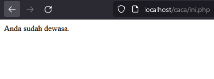
### analisis
`$umur = 18;`: Baris ini mendefinisikan variabel `$umur` dan menginisialisasinya dengan nilai 18.
`if ($umur >= 18) {`: Ini adalah sebuah statement kondisional. Dalam konteks ini, ia memeriksa apakah nilai dari variabel `$umur` lebih besar dari atau sama dengan 18. 
`echo "Anda sudah dewasa.";`: Jika kondisi di atas terpenuhi (nilai `$umur` lebih besar dari atau sama dengan 18), maka statement ini akan dieksekusi. Ini akan mencetak pesan "Anda sudah dewasa." ke dalam output.
### kesimpulan
Jadi, keseluruhan program ini akan mencetak pesan "Anda sudah dewasa." karena nilai variabel `$umur` adalah 18, yang memenuhi kondisi yang diberikan.
## if-else
### penjelasan
Pernyataan kondisional `if-else` adalah salah satu struktur kontrol yang paling umum digunakan dalam pemrograman. Ini memungkinkan program untuk membuat keputusan dan melakukan tindakan yang berbeda berdasarkan evaluasi kondisi tertentu.
### struktur
```php
if (kondisi) {
    // blok kode yang dieksekusi jika kondisi bernilai true
} else {
    // blok kode yang dieksekusi jika kondisi bernilai false
}
```
### kode program
```php
$umur = 18;
if ($umur >= 18) {
    echo "Anda masih anak-anak.";
} else {
    echo "Anda sudah dewasa.";
}
```
### hasil
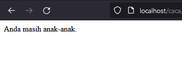
### analisis
`$umur = 18;`: Ini adalah inisialisasi variabel `$umur` dengan nilai 18. Variabel ini akan digunakan untuk menentukan apakah seseorang masih dianggap anak-anak atau sudah dewasa.    
`if ($umur >= 18) { ... } else { ... }`: Ini adalah struktur kontrol yang digunakan untuk mengevaluasi kondisi. Pada baris ini, program memeriksa apakah nilai dari variabel `$umur` lebih besar dari atau sama dengan 18. Jika kondisi ini benar (true), maka blok kode di dalam kurung kurawal `{}` setelah pernyataan `if` akan dieksekusi. Jika kondisi tersebut salah (false), maka blok kode di dalam kurung kurawal `{}` setelah pernyataan `else` akan dieksekusi.
`echo "Anda masih anak-anak.";`: Ini adalah pernyataan yang dicetak (dalam bahasa Indonesia) jika kondisi di pernyataan `if` terpenuhi, yaitu jika nilai `$umur` lebih besar dari atau sama dengan 18.
`echo "Anda sudah dewasa.";`: Ini adalah pernyataan yang dicetak jika kondisi di pernyataan `if` tidak terpenuhi, artinya jika nilai `$umur` kurang dari 18.
### kesimpulan
Jadi, keseluruhan program ini akan mencetak "Anda masih anak-anak." jika nilai `$umur` adalah 18 atau lebih besar, dan akan mencetak "Anda sudah dewasa." jika nilai `$umur` kurang dari 18.
## if-else if-else
### penjelasan
Struktur kontrol `if-else if-else` digunakan dalam pemrograman untuk mengevaluasi beberapa kondisi secara berturut-turut. Ini memungkinkan program untuk memilih antara beberapa blok kode yang akan dieksekusi berdasarkan nilai dari suatu ekspresi atau kondisi.
### struktur
```php
if (kondisi1) {
    // blok kode yang dieksekusi jika kondisi1 bernilai true
} elseif (kondisi2) {
    // blok kode yang dieksekusi jika kondisi2 bernilai true
} else {
    // blok kode yang dieksekusi jika semua kondisi sebelumnya bernilai false
}
```
### kode program
```php
$nilai = 75;
if ($nilai >= 90) {
    echo "Nilai Anda A.";
} elseif ($nilai >= 80) {
    echo "Nilai Anda B.";
} elseif ($nilai >= 70) {
    echo "Nilai Anda C.";
} elseif ($nilai >= 60) {
    echo "Nilai Anda D.";
} else {
    echo "Nilai Anda E.";
}
```
### hasil
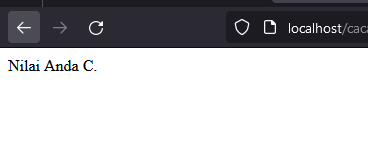
### analisis
`if ($nilai >= 90) { ... }`: Pertama, program memeriksa apakah nilai `$nilai` lebih besar dari atau sama dengan 90. Jika benar, program mencetak "Nilai Anda A." dan tidak memeriksa kondisi berikutnya.
`elseif ($nilai >= 80) { ... }`: Jika kondisi pertama tidak terpenuhi (nilai `$nilai` tidak lebih besar dari atau sama dengan 90), program kemudian memeriksa apakah nilai `$nilai` lebih besar dari atau sama dengan 80. Jika ya, program mencetak "Nilai Anda B." dan tidak memeriksa kondisi berikutnya.
`elseif ($nilai >= 70) { ... }`: Jika kondisi kedua tidak terpenuhi, program kemudian memeriksa apakah nilai `$nilai` lebih besar dari atau sama dengan 70. Jika ya, program mencetak "Nilai Anda C." dan tidak memeriksa kondisi berikutnya.
`elseif ($nilai >= 60) { ... }`: Jika kondisi ketiga tidak terpenuhi, program kemudian memeriksa apakah nilai `$nilai` lebih besar dari atau sama dengan 60. Jika ya, program mencetak "Nilai Anda D." dan tidak memeriksa kondisi berikutnya.
`else { ... }`: Jika semua kondisi sebelumnya tidak terpenuhi (artinya nilai `$nilai` kurang dari 60), program akan mencetak "Nilai Anda E."
### kesimpulan
jadi, program ini mengklasifikasikan nilai berdasarkan rentang tertentu dan mencetak pesan sesuai dengan klasifikasi tersebut.
## switch-case
### penjelasan
`Switch-case` adalah sebuah pernyataan kondisional yang digunakan dalam pemrograman untuk mengevaluasi ekspresi tunggal terhadap sejumlah nilai yang mungkin. Pernyataan switch-case memungkinkan program untuk memutuskan aliran eksekusi berdasarkan nilai ekspresi tersebut.
### struktur
```php
switch ($ekspresi) {
    case nilai1:
        // pernyataan yang akan dieksekusi jika $ekspresi sama dengan nilai1
        break;
    case nilai2:
        // pernyataan yang akan dieksekusi jika $ekspresi sama dengan nilai2
        break;
    case nilai3:
        // pernyataan yang akan dieksekusi jika $ekspresi sama dengan nilai3
        break;
    default:
        // pernyataan yang akan dieksekusi jika tidak ada kesesuaian dengan kasus sebelumnya
}
```
### kode program
```php
$nilai = 2;
switch ($nilai) {
    case 1:
        echo "Nilai adalah 1";
        break;
    case 2:
        echo "Nilai adalah 2";
        break;
    case 3:
        echo "Nilai adalah 3";
        break;
    default:
        echo "Nilai tidak ditemukan";
}
```
### hasil
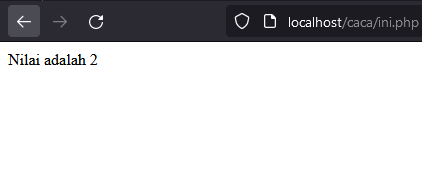
### analisis
Variabel `$nilai` diinisialisasi dengan nilai 2.
Program memeriksa nilai dari variabel `$nilai` dalam blok `switch ($nilai)`.
Program mengevaluasi `case` pertama:    
    - `case 1:` Program memeriksa apakah nilai variabel `$nilai` adalah 1. Karena `$nilai` bukan 1, maka program tidak menjalankan kode dalam `case 1`.
Program mengevaluasi `case` kedua:    
    - `case 2:` Karena nilai variabel `$nilai` adalah 2, program menjalankan kode dalam `case 2`.
    - Program mencetak "Nilai adalah 2".
    - Setelah itu, program menemukan pernyataan `break`, sehingga keluar dari blok `switch`.
Karena sudah ada kecocokan dengan `case 2`, program tidak mengevaluasi `case` lainnya.    
Eksekusi program selesai setelah mencetak pesan "Nilai adalah 2".
### kesimpulan
Jadi, secara keseluruhan, saat nilai variabel `$nilai` adalah 2, program akan mencetak "Nilai adalah 2" dan kemudian keluar dari blok `switch`. Karena tidak ada kecocokan dengan `case` lainnya, program tidak mengeksekusi kode di dalam `case` lain atau `default`.
# array
## array 1 dimensi
### penjelasan
Sebuah `array satu dimensi` adalah struktur data yang dapat menyimpan sejumlah elemen data, di mana setiap elemen memiliki indeks yang unik. Dalam array satu dimensi, elemen-elemennya disusun dalam satu baris atau satu dimensi.
### struktur
```php
$array = [nilai1, nilai2, nilai3, ...];
```
### kode program
```php
$buah = ["Apel", "Pisang", "Jeruk", "Anggur", "Mangga"];
echo $buah[0]; 
echo $buah[1]; 
echo $buah[2];
echo $buah[3];
echo $buah[4];
```
### hasil
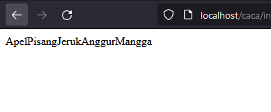
### analisis
`$buah = ["Apel", "Pisang", "Jeruk", "Anggur", "Mangga"];`:    
    - Pernyataan ini membuat sebuah array dengan nama variabel `$buah`.
    - Array tersebut berisi lima elemen, yaitu "Apel", "Pisang", "Jeruk", "Anggur", dan "Mangga".
`echo $buah[0];`:
    - Ini adalah perintah untuk mencetak elemen pertama dari array `$buah`.
    - Karena indeks array dimulai dari 0, `$buah[0]` akan mencetak "Apel".
`echo $buah[1];`:    
    - Ini adalah perintah untuk mencetak elemen kedua dari array `$buah`.
    - `$buah[1]` akan mencetak "Pisang".
`echo $buah[2];`:    
    - Ini adalah perintah untuk mencetak elemen ketiga dari array `$buah`.
    - `$buah[2]` akan mencetak "Jeruk".
`echo $buah[3];`:    
    - Ini adalah perintah untuk mencetak elemen keempat dari array `$buah`.
    - `$buah[3]` akan mencetak "Anggur".
`echo $buah[4];`:    
    - Ini adalah perintah untuk mencetak elemen kelima (terakhir) dari array `$buah`.
    - `$buah[4]` akan mencetak "Mangga".
### kesimpulan
Jadi, secara keseluruhan, program tersebut membuat array yang berisi daftar nama-nama buah, dan kemudian mencetak setiap elemen dari array tersebut satu per satu secara berurutan.
## array asosiatif
### penjelasan
`Array asosiatif` adalah struktur data di mana setiap elemen dalam array memiliki kunci atau label yang terkait dengannya, bukan hanya indeks numerik seperti pada array biasa. Ini memungkinkan kita untuk menyimpan data dalam bentuk pasangan "kunci-nilai".
### struktur
```php
$array = [
    'kunci1' => nilai1,
    'kunci2' => nilai2,
    'kunci3' => nilai3,
    // dan seterusnya
];
```
### kode program
```php
$kontak = [
    'nama' => 'John Doe',
    'email' => 'john@example.com',
    'telepon' => '123-456-7890'
];
echo $kontak['nama']; 
echo $kontak['email'];  
echo $kontak['telepon'];
```
### hasil
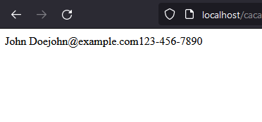
### analisis
`$kontak['nama']` mengembalikan nilai `'John Doe'`, yang merupakan nama kontak.
`$kontak['email']` mengembalikan nilai `'john@example.com'`, yang merupakan alamat email kontak.
`$kontak['telepon']` mengembalikan nilai `'123-456-7890'`, yang merupakan nomor telepon kontak.
`echo $kontak['nama'];`: Ini adalah perintah untuk mencetak nilai yang disimpan dalam array `$kontak` pada kunci atau indeks `'nama'`. Jadi, jika `$kontak['nama']` mengandung nilai misalnya "John Doe", perintah ini akan mencetak "John Doe" ke output.
`echo $kontak['email'];`: Ini adalah perintah yang mirip dengan yang pertama, tetapi mencetak nilai yang disimpan dalam array `$kontak` pada kunci atau indeks `'email'`. Jika, misalnya, `$kontak['email']` mengandung nilai "john@example.com", perintah ini akan mencetak "john@example.com" ke output.
`echo $kontak['telepon'];`: Sekali lagi, ini adalah perintah yang mirip dengan dua sebelumnya, tetapi kali ini mencetak nilai yang disimpan dalam array `$kontak` pada kunci atau indeks `'telepon'`. Jika, misalnya, `$kontak['telepon']` mengandung nilai "123-456-7890", perintah ini akan mencetak "123-456-7890" ke output.
### kesimpulan
Jadi, kode tersebut bertujuan untuk membuat, mengakses, dan mencetak informasi kontak yang disimpan dalam array asosiatif.
## array multidimensi
### penjelasan
`Array multidimensi` adalah struktur data di mana setiap elemen array dapat berupa array sendiri. Ini berarti Anda memiliki array dalam array.
### struktur
```php
$array = array(
    array(nilai1, nilai2, nilai3, ...),
    array(nilai4, nilai5, nilai6, ...),
    ...
);
```
### kode program
```php
 $matriks = array(
    array(1, 2, 3),
    array(4, 5, 6),
    array(7, 8, 9)
);
echo $matriks[0][0]; // Output: 1
echo $matriks[1][1]; // Output: 5
echo $matriks[2][2]; // Output: 9
```
### hasil
.png)
### analisis
1. Baris pertama mendefinisikan variabel `$matriks` sebagai array multidimensi yang terdiri dari tiga array dalam array. Setiap array dalam array tersebut merepresentasikan satu baris dalam matriks.
    - Baris pertama matriks: array(1, 2, 3)
    - Baris kedua matriks: array(4, 5, 6)
    - Baris ketiga matriks: array(7, 8, 9)
2. Baris kedua (`echo $matriks[0][0];`) mencetak nilai yang terletak pada baris pertama (indeks 0) dan kolom pertama (indeks 0) dalam matriks. Outputnya adalah 1.
3. Baris ketiga (`echo $matriks[1][1];`) mencetak nilai yang terletak pada baris kedua (indeks 1) dan kolom kedua (indeks 1) dalam matriks. Outputnya adalah 5.
4. Baris keempat (`echo $matriks[2][2];`) mencetak nilai yang terletak pada baris ketiga (indeks 2) dan kolom ketiga (indeks 2) dalam matriks. Outputnya adalah 9.
### kesimpulan
Program ini menggunakan array multidimensi untuk menyimpan dan mengakses matriks angka. Dengan menggunakan indeks berlapis, kita dapat mengakses nilai-nilai yang terletak pada baris dan kolom tertentu dalam matriks. Dalam contoh ini, program mencetak nilai-nilai dalam matriks sesuai dengan indeks yang ditentukan.
# var_dump
### penjelasan 
`var_dump` adalah sebuah fungsi di dalam PHP yang digunakan untuk mencetak informasi rinci tentang satu atau lebih variabel, termasuk tipe data, nilai, dan ukuran variabel tersebut. Fungsi ini berguna dalam proses debugging dan analisis variabel.
### struktur
```php
var_dump($variable);
```
### kode program
```php
$nama = "John Doe";
$umur = 30;
$nilai = 85.5;
$array = [1, 2, 3];

var_dump($nama);
var_dump($umur);
var_dump($nilai);
var_dump($array);
```
### hasil
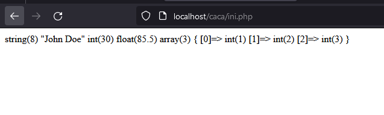
### analisis
`$nama = "John Doe";`: Baris ini menginisialisasi variabel `$nama` dengan string "John Doe".    
    - Hasil dari `var_dump($nama);` adalah `string(8) "John Doe"`.
    - Informasi yang dicetak adalah tipe data variabel (`string`) dan nilai variabel (`John Doe`). Ukuran string adalah 8 karakter.
`$umur = 30;`: Baris ini menginisialisasi variabel `$umur` dengan nilai 30.    
    - Hasil dari `var_dump($umur);` adalah `int(30)`.
    - Informasi yang dicetak adalah tipe data variabel (`int`) dan nilai variabel (`30`).
`$nilai = 85.5;`: Baris ini menginisialisasi variabel `$nilai` dengan nilai float 85.5.    
    - Hasil dari `var_dump($nilai);` adalah `float(85.5)`.
    - Informasi yang dicetak adalah tipe data variabel (`float`) dan nilai variabel (`85.5`).
`$array = [1, 2, 3];`: Baris ini menginisialisasi variabel `$array` dengan array `[1, 2, 3]`.    
    - Hasil dari `var_dump($array);` adalah `array(3) { [0]=> int(1) [1]=> int(2) [2]=> int(3) }`.
    - Informasi yang dicetak adalah tipe data variabel (`array`) dan jumlah elemen array (`3`).
    - Setiap elemen array dicetak dengan indeksnya dan nilai integer yang sesuai.
### kesimpulan
Dengan menggunakan `var_dump`, Anda dapat melihat tipe data dan nilai variabel dengan lebih jelas. Hal ini berguna dalam debugging dan memahami struktur data yang digunakan dalam program Anda.
# looping (pembagian)
## for
### penjelasan 
Looping `for` adalah salah satu konstruksi pengulangan yang digunakan dalam pemrograman untuk melakukan tugas-tugas yang berulang dengan cara yang terstruktur.
### struktur
```php
for (inisialisasi; kondisi; perubahan) {
    // Blok kode yang akan diulang
}
```
### kode program 
```php
for ($i = 1; $i <= 5; $i++) {
    echo $i . " ";
}
```
### hasil
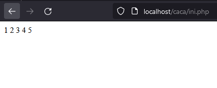
### analisis
`for (`: Ini menandakan dimulainya sebuah loop `for`.    
`$i = 1;`: Ini adalah inisialisasi variabel `$i` dengan nilai awal 1. Variabel ini akan digunakan sebagai penghitung loop.
`$i <= 5;`: Ini adalah kondisi perulangan. Loop akan terus berjalan selama nilai `$i` kurang dari atau sama dengan 5.
`$i++`: Ini adalah ekspresi increment. Setiap kali loop selesai dieksekusi, nilai variabel `$i` akan bertambah satu.
`) {`: Ini menandakan akhir dari bagian inisialisasi dan kondisi loop, serta awal dari blok kode yang akan diulang.
`echo $i . " ";`: Ini adalah bagian dari blok kode yang akan diulang. Pada setiap iterasi, nilai variabel `$i` akan dicetak ke layar, diikuti dengan spasi.
`}`: Ini menandakan akhir dari blok kode yang akan diulang.
### kesimpulan
Jadi, loop ini akan mencetak angka dari 1 hingga 5, dengan setiap angka dipisahkan oleh spasi.

## while
### penjelasan
Perulangan `while` adalah jenis perulangan yang digunakan untuk mengulang blok kode selama suatu kondisi bernilai `true`.
### struktur
```php
while (kondisi) {
    // Blok kode yang akan diulang
}
```
### kode program
```php
$i = 1;
while ($i <= 10) {
    echo $i . " ";
    $i++;
}
```
### hasil
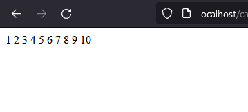
### analisis
`$i = 1;`: Ini adalah inisialisasi variabel `$i` dengan nilai 1. Variabel `$i` digunakan sebagai penghitung iterasi dalam loop.
`while ($i <= 10) {`: Ini adalah struktur loop `while`. Ini berarti bahwa selama kondisi dalam tanda kurung kurang dari atau sama dengan 10, blok kode dalam kurung kurawal akan terus dieksekusi.
`echo $i . " ";`: Ini mencetak nilai variabel `$i` diikuti oleh spasi ke layar. Variabel `$i` adalah penghitung iterasi, jadi nilai akan mulai dari 1 dan bertambah setiap kali loop dieksekusi.
`$i++;`: Ini adalah langkah iterasi di dalam loop. Setiap kali loop dieksekusi, nilai variabel `$i` akan bertambah satu.
### kesimpulan
Jadi, kode tersebut akan mencetak angka dari 1 hingga 10 ke layar, dipisahkan oleh spasi. Setelah mencapai 10, kondisi `$i <= 10` tidak lagi terpenuhi, dan loop berhenti.
## do-while
### penjelasan
Perulangan `do-while` adalah jenis perulangan yang digunakan untuk mengulang blok kode setidaknya satu kali, dan akan terus mengulang selama suatu kondisi bernilai `true`.
### struktur
```php
do {
    // Blok kode yang akan diulang
} while (kondisi);
```
### kode program
```php
$i = 1;
do {
    echo $i . " ";
    $i++;
} while ($i <= 20);
```
### hasil
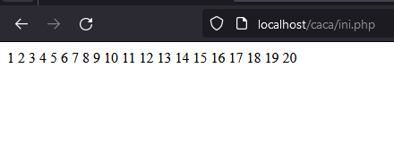
### analisis
`<?php` dan `?>` menandakan awal dan akhir dari blok kode PHP.
`$i = 1;` ini adalah inisialisasi variabel `$i` dengan nilai 1. Variabel ini akan digunakan untuk melacak nilai saat ini dalam perulangan.
`do { ... } while ($i <= 20);`: Ini adalah konstruksi perulangan do-while. Ini berarti kode dalam blok kurung kurawal `{}` akan dieksekusi sekali terlepas dari apapun. Setelah itu, kondisi yang diperiksa adalah `$i <= 20`. Jika kondisi ini benar (true), blok kode akan diulang kembali.
`echo $i . " ";`: Ini mencetak nilai variabel `$i` diikuti oleh spasi. Ini akan mencetak nilai variabel `$i` yang saat ini diinisialisasi pada 1.
`$i++;`: Ini adalah operasi peningkatan yang meningkatkan nilai variabel `$i` sebesar 1 setiap kali blok kode dijalankan. Dengan demikian, nilai `$i` akan bertambah setiap kali blok kode diulang.
### kesimpulan
Jadi, secara keseluruhan, kode ini akan mencetak angka dari 1 hingga 20, satu per satu, dipisahkan oleh spasi. Setelah mencetak angka 20, perulangan akan berhenti karena nilai `$i` akan menjadi 21, dan kondisi `while ($i <= 20)` tidak lagi benar.
## foreach
### penjelasan
Perulangan `foreach` digunakan khusus untuk mengulang elemen-elemen dalam sebuah array atau objek.
### struktur
```php
foreach ($arrayOrObjek as $nilai) {
    // Blok kode yang akan diulang
}
```
### kode program
```php
$angka = array(1, 2, 3, 4, 5, 6, 7, 8, 9);
foreach ($angka as $nilai) {
    echo $nilai . " ";
}
```
### hasil
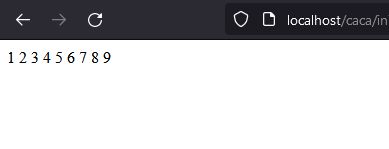
### analisis
`$angka = array(1, 2, 3, 4, 5, 6, 7, 8, 9);`: Pada baris ini, kita mendefinisikan sebuah array dengan nama `$angka` yang berisi bilangan dari 1 hingga 9.
`foreach ($angka as $nilai) {`: Ini adalah struktur `foreach` dalam PHP. Ini berarti untuk setiap elemen dalam array `$angka`, kita beri nama variabel sementara `$nilai` untuk mengakses nilai setiap elemen tersebut.
`echo $nilai . " ";`: Dalam setiap iterasi, nilai dari elemen array yang sedang diproses disimpan dalam variabel `$nilai`, dan kemudian dicetak menggunakan perintah `echo`. Tambahkan spasi setelah nilai untuk memisahkan nilai-nilai yang dicetak.
### kesimpulan
Jadi, secara keseluruhan, kode ini akan mencetak setiap nilai dalam array `$angka` dengan spasi sebagai pemisah. Misalnya, outputnya akan menjadi:
# funtion
### penjelasan
`Funtion` adalah blok kode yang terpisah dan dapat dipanggil secara berulang untuk melakukan tugas tertentu. Fungsi membantu memecah program menjadi bagian-bagian yang lebih kecil dan terorganisir, sehingga memudahkan pemeliharaan dan pengembangan kode. Dalam PHP, fungsi dapat menerima argumen sebagai input dan mengembalikan nilai sebagai output.
### struktur
```php
function namaFungsi($argumen1, $argumen2, ...) {
    // Blok kode fungsi
    return $nilaiKembali;
}
```
### kode program 
```php
function hitungLuasSegitiga($alas, $tinggi) {
    $luas = (1/2) * $alas * $tinggi;
    return $luas;
}
$alasSegitiga = 8;
$tinggiSegitiga = 5;
$luasSegitiga = hitungLuasSegitiga($alasSegitiga, $tinggiSegitiga);
echo "Luas segitiga dengan alas $alasSegitiga dan tinggi $tinggiSegitiga adalah: $luasSegitiga";
```
### hasil
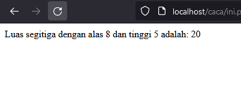
### analisis
`function hitungLuasSegitiga($alas, $tinggi) { ... }`: Ini adalah definisi fungsi `hitungLuasSegitiga()` yang menerima dua parameter, yaitu `$alas` dan `$tinggi`.
`$luas = (1/2) * $alas * $tinggi;`: Di dalam fungsi, luas segitiga dihitung dengan rumus luas segitiga yaitu setengah kali produk alas dan tinggi.
`return $luas;`: Fungsi mengembalikan hasil perhitungan luas segitiga.
`$alasSegitiga = 8;` dan `$tinggiSegitiga = 5;`: Di luar fungsi, dua variabel `$alasSegitiga` dan `$tinggiSegitiga` diinisialisasi dengan nilai 8 dan 5 masing-masing.
`$luasSegitiga = hitungLuasSegitiga($alasSegitiga, $tinggiSegitiga);`: Variabel `$luasSegitiga` kemudian diisi dengan hasil dari pemanggilan fungsi `hitungLuasSegitiga()` dengan parameter yang sesuai.
`echo "Luas segitiga dengan alas $alasSegitiga dan tinggi $tinggiSegitiga adalah: $luasSegitiga";`: Hasil luas segitiga kemudian dicetak menggunakan pernyataan `echo`, menampilkan nilai alas dan tinggi yang digunakan dalam perhitungan serta hasil luasnya.
### kesimpulan
Program ini menghitung luas segitiga dengan alas 8 dan tinggi 5 menggunakan fungsi `hitungLuasSegitiga()`. Hasil perhitungan luas segitiga kemudian ditampilkan dalam pesan yang mencakup nilai alas, tinggi, dan luas segitiga.
# php form
## get method
### penjelasan
Metode `GET` dalam PHP digunakan untuk mengakses dan mengambil data yang dikirimkan melalui permintaan HTTP menggunakan metode `GET`. Data ini dapat berupa parameter kueri yang disertakan dalam URL.
### struktur
```php
<?php
if ($_SERVER['REQUEST_METHOD'] === 'GET') {
    // Tangkap nilai dari parameter kueri
    $name = $_GET['name'];
    $age = $_GET['age'];
    // Lakukan pemrosesan data
    // ...
    // Tampilkan hasil atau lakukan tindakan lain
    // ...
}  
?>
```
### kode program 
```html
<!DOCTYPE html>
<html>
<head>
    <title>Contoh Form GET</title>
</head>
<body>
    <form method="GET" action="page.php">
        <label for="name">Nama:</label>
        <input type="text" name="name" id="name">

        <label for="age">Usia:</label>
        <input type="number" name="age" id="age">

        <input type="submit" value="Kirim">
    </form>
</body>
</html>
```

```php
<?php
if ($_SERVER['REQUEST_METHOD'] === 'GET') {
    // Tangkap nilai dari parameter kueri
    $name = $_GET['name'];
    $age = $_GET['age'];

    // Tampilkan hasil atau lakukan tindakan lain
    echo "Halo, $name! Usia Anda adalah $age tahun.";
}
?>
```
### hasil
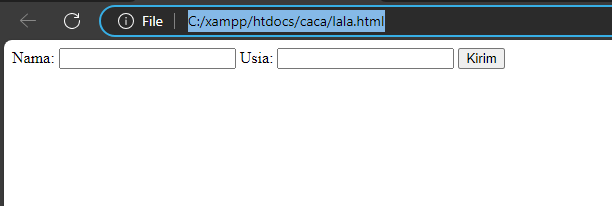 

.png)
### analisis
**Pemeriksaan Metode Permintaan**
    - Program menggunakan `$_SERVER['REQUEST_METHOD']` untuk memeriksa metode permintaan HTTP yang digunakan.
    - Jika metode permintaan adalah GET, maka program akan melanjutkan eksekusi.
- **Pengambilan Nilai Parameter Kueri**:
- `// Tangkap nilai dari parameter kueri $name = $_GET['name']; $age = $_GET['age'];`
    - Program mengambil nilai dari parameter kueri 'name' dan 'age' menggunakan variabel `$_GET`.
    - Variabel-variabel ini kemudian digunakan dalam pesan yang akan ditampilkan.
- **Tindakan Berdasarkan Hasil Pemeriksaan**:
`// Tampilkan hasil atau lakukan tindakan lain echo "Halo, $name! Usia Anda adalah $age tahun.";`
- Jika metode permintaan adalah GET, maka program akan menampilkan pesan dengan nama dan usia yang diberikan dalam parameter kueri.
### kesimpulan
- Program ini digunakan untuk menangani permintaan GET dengan memeriksa metode permintaan HTTP.
- Jika metode permintaan adalah GET, program akan mengambil nilai parameter kueri 'name' dan 'age', lalu menampilkan pesan dengan informasi tersebut.
- Ini adalah contoh sederhana dari bagaimana PHP dapat digunakan untuk menangani permintaan HTTP dan meresponsnya berdasarkan kondisi yang ditentukan.
## post method
###  penjelasan
Metode POST digunakan untuk mengirimkan data dari client ke server. Data dikirimkan dalam tubuh permintaan HTTP dan tidak terlihat dalam URL seperti metode GET. Metode POST lebih aman untuk mengirim data sensitif seperti kata sandi. Dalam PHP, data yang dikirim melalui metode POST dapat diakses menggunakan variabel global `$_POST`.
### struktur
```php
<?php
// Periksa apakah formulir telah dikirimkan
if ($_SERVER['REQUEST_METHOD'] === 'POST') {
  // Dapatkan nilai field formulir
  $name = $_POST['name'];
  $email = $_POST['email'];
  // Lakukan sesuatu dengan data yang dikirimkan
  echo "Nama: $name<br>";
  echo "Email: $email<br>";
}
?>
```
### kode program 
```php
<?php
// Periksa apakah formulir telah dikirimkan
if ($_SERVER['REQUEST_METHOD'] === 'POST') {
  // Dapatkan nilai field formulir
  $name = $_POST['name'];
  $email = $_POST['email'];
  // Lakukan sesuatu dengan data yang dikirimkan
  echo "Nama: $name<br>";
  echo "Email: $email<br>";
}
?>
```

```php
<?php
// Key dari array-nya, sesuai dengan nama dari atribut name di setiap input-nya
$nama = $_POST["nama"];
$umur = $_POST["umur"];  
var_dump($_POST);
?>
<!DOCTYPE html>
<html lang="en">
<head>
    <title> XI RPL 1 - POST</title>
</head>
<body>
    <p>Nama anda <?= $_POST["nama_lengkap"] ?></p>
    <p>Umur anda <?= $umur ?> tahun</p>
    <p>Password anda aman!</p>
</body>
</html>
```
### hasil
.png)

.png)
### analisis
1. Pada bagian HTML:
    - Terdapat sebuah form dengan atribut `action` yang berisi "proses_post.php", yang menunjukkan bahwa data akan dikirim ke file "proses_post.php" untuk diproses.
    - Form tersebut menggunakan metode POST dengan atribut `method="POST"`.
    - Terdapat tiga input field yaitu "nama_lengkap", "umur", dan "password" yang akan dikirimkan ke file "proses_post.php".
    - Terdapat tombol submit dengan teks "Kirim", yang akan mengirimkan data form saat ditekan.
2. Pada bagian PHP di file "proses_post.php":
    - Data yang dikirim melalui form akan ditangkap menggunakan variabel `$_POST` dengan key yang sesuai dengan atribut `name` pada input field.
    - Terdapat variabel `$nama` dan `$umur` yang ditugaskan dengan nilai dari `$_POST["nama"]` dan `$_POST["umur"]` secara berturut-turut. Namun, di form HTML tidak ada input field dengan atribut `name="nama"`, sehingga ini dapat menyebabkan kesalahan ketika mencoba mengakses nilai tersebut.
    - Terdapat fungsi `var_dump($_POST)` yang digunakan untuk menampilkan semua data yang diterima melalui metode POST. Fungsi ini berguna untuk debugging dan melihat nilai-nilai yang diterima.
    - Setelah itu, program melanjutkan ke bagian HTML di bawahnya.
3. Kembali ke bagian HTML di file yang sama:
    - Terdapat beberapa elemen `<p>` yang menampilkan hasil dari data yang diterima.
    - Pada elemen `<p>` pertama, menggunakan `$_POST["nama_lengkap"]` untuk menampilkan nilai dari input field "nama_lengkap" yang dikirim melalui metode POST.
    - Pada elemen `<p>` kedua, menggunakan variabel `$umur` yang telah diisi dengan nilai dari `$_POST["umur"]` untuk menampilkan nilai umur.
    - Pada elemen `<p>` ketiga, menampilkan pesan statis "Password anda aman!".
### kesimpulan
Program ini adalah sebuah halaman HTML dengan form yang mengirim data menggunakan metode POST. Data yang dikirim kemudian ditangkap di file "proses_post.php" menggunakan variabel `$_POST`. Namun, ada ketidaksesuaian antara atribut `name` pada input field dengan variabel yang digunakan di PHP. Sehingga, program ini perlu diperbaiki dengan mengganti atribut `name="nama_lengkap"` menjadi `name="nama"` agar sesuai dengan variabel yang digunakan di PHP. Selain itu, program juga bisa ditingkatkan dengan penanganan data yang lebih baik, seperti validasi input, sanitasi data, dan penggunaan metode keamanan yang lebih baik untuk mengelola password.

